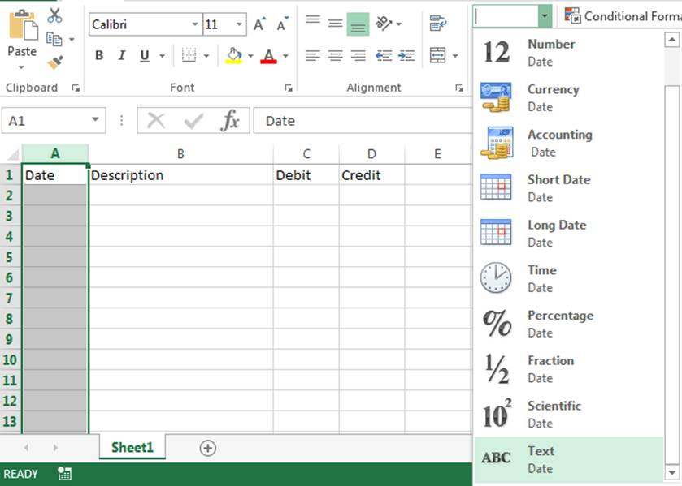
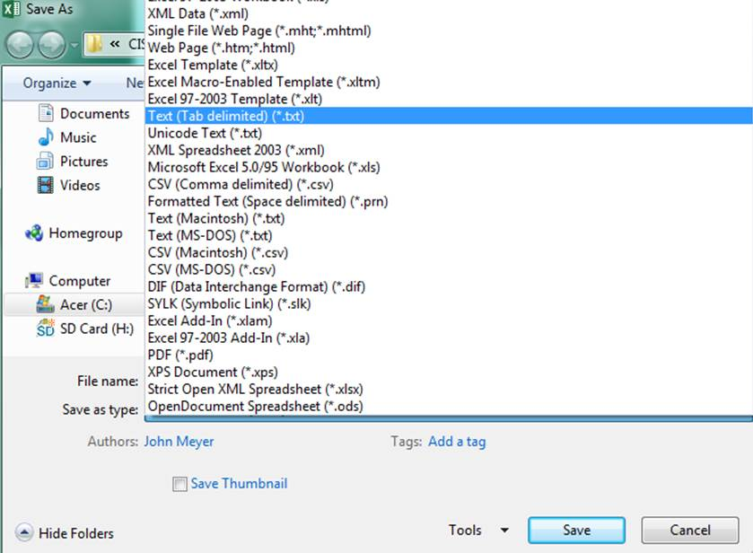
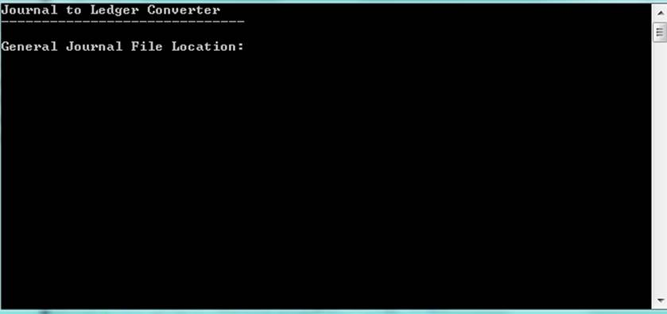
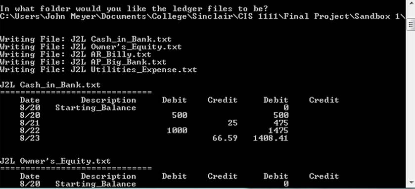

# Journal to Ledger Converter - Documentation

This program converts an accounting General Journal to accounting ledgers.

## How to set up General Journal File

  1. Open Excel
  2. Create a General Journal with the headers: `Date`, `Description`, `Debit`, `Credit`
  3. Set the `Date` column to `Text`:
  4. 
  5. Save the file as `Text (Tab Delimited) (*.txt)`
  6. 

## How to use the Program

  1. Execute the program
  2. Enter the file’s path (folder location + filename + file extension)
  3. 
  4. Wait for the program to convert the General Journal file to individual ledgers.
  5. Enter a folder location for the ledgers to be saved in
  6. 
  7. The program will save the ledgers it created then read them back to you for your convenience
  8. 
